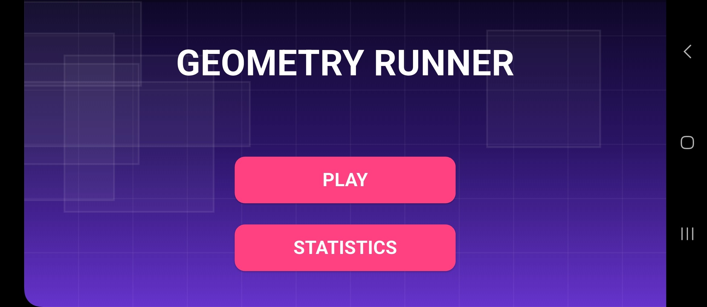
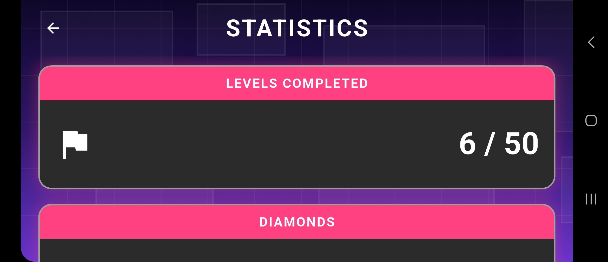
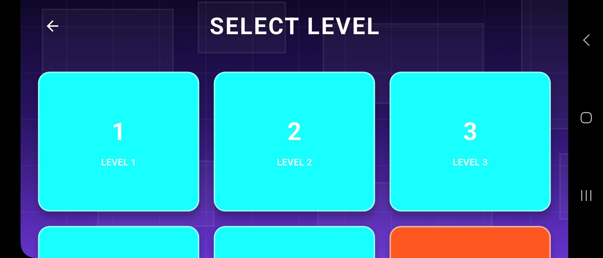
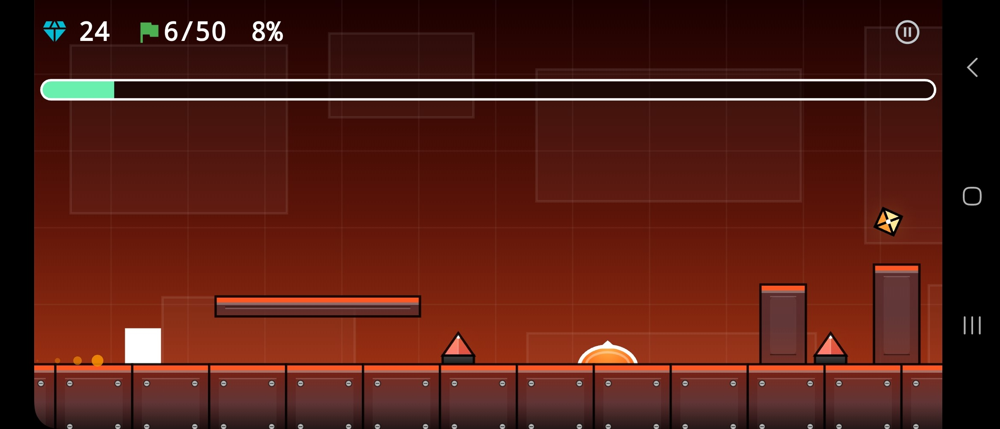

# geometry_dash

Small Geometry Dash clone implemented using clean architecture.

## Description

This project is a simple version of Geometry Dash built with Flutter.
It uses Flame for animations, physics, and game elements, and follows clean architecture principles to organize code and logic.

## Screenshots

  
  
  
  

## Technologies

- Flutter
- Flame
- Riverpod
- Shared Preferences

## Features

- Geometry Dash-like gameplay
- Animations and physics with Flame
- Clean architecture code structure
- Simple data persistence with shared_preferences

## Setup

1. Clone the repository.
2. Run `flutter pub get`.
3. Start the project with `flutter run`.
